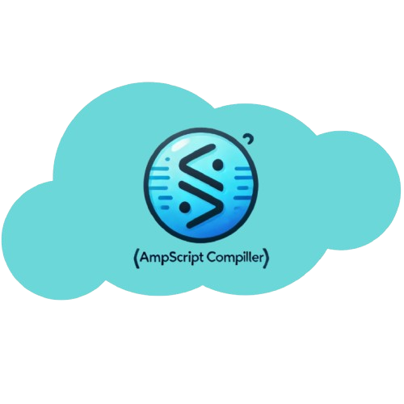

# AMPscript Compiler



O **AMPscript Compiler** é uma ferramenta desenvolvida para compilar códigos AMPscript para HTML dinâmico, facilitando a integração de códigos AMPscript em campanhas de marketing utilizando Salesforce Marketing Cloud. Com esta ferramenta, você pode ver como o AMPscript gera conteúdo dinâmico em HTML, o que é extremamente útil para quem trabalha com automações e e-mails personalizados.

## Como Funciona

O projeto permite que os usuários insiram códigos AMPscript em um campo de texto, visualize o código AMPscript compilado em HTML e observe como as variáveis e funções específicas como `CONCAT`, `UPPER`, `ADD`, `SUBTRACT`, `MULTIPLY` e `DIVIDE` são processadas e aplicadas em tempo real. Com a capacidade de inserir exemplos diretamente no editor, o usuário pode aprender rapidamente sobre o funcionamento do AMPscript e testar diferentes operações e expressões.


## Tecnologias Utilizadas

- **JavaScript**: Linguagem principal do projeto.
- **AMPscript**: Linguagem de script usada no Salesforce Marketing Cloud.
- **HTML/CSS**: Para criar a interface de usuário.
- **Live-server**: Para facilitar a execução e visualização local do projeto.

## Funcionalidades

- Carregamento de exemplos de AMPscript diretamente de arquivos `.txt`.
- Exibição do HTML compilado sem tags, simulando o comportamento real do código AMPscript.
- Interface simples e intuitiva com um editor de texto para colar ou digitar código AMPscript.

## Instalação e Execução Local

### Requisitos

Antes de rodar o projeto localmente, certifique-se de ter o **Node.js** instalado em sua máquina. Se não tiver, você pode baixá-lo [aqui](https://nodejs.org/).

### Passos

1. Clone o repositório para o seu ambiente local:

   ```bash
   git clone https://github.com/seu-usuario/ampscript-compiler.git
   ```

2. Navegue até o diretório do projeto:

   ```bash
   cd ampscript-compiler
   ```

3. Instale as dependências do projeto:

   ```bash
   npm install
   ```

4. Inicie o servidor local para visualizar a aplicação:

   ```bash
   npm start
   ```

   Isso abrirá a aplicação em [http://localhost:8080](http://localhost:8080).

## Acessar o Projeto Online

Você também pode acessar a versão online do projeto aqui:

[https://seu-link-do-projeto](https://seu-link-do-projeto)

## Como Contribuir

1. Fork o repositório.
2. Crie uma branch para a sua feature (`git checkout -b feature/nova-feature`).
3. Faça suas alterações e envie um commit (`git commit -am 'Adiciona nova feature'`).
4. Envie sua branch para o repositório (`git push origin feature/nova-feature`).
5. Crie um pull request.

## Experiência do Desenvolvedor

Durante o desenvolvimento deste projeto, tive a oportunidade de praticar muitas habilidades essenciais de programação, como manipulação de arquivos, escrita de funções e interação com o DOM utilizando JavaScript. Além disso, foi uma excelente oportunidade para aprender sobre o **AMPscript**, uma linguagem de script usada principalmente em automações de marketing no Salesforce Marketing Cloud, o que é uma habilidade importante para os dias de hoje, pois muitas empresas utilizam essa plataforma para personalizar suas campanhas de e-mail e automações.

Esse projeto me permitiu não apenas melhorar minha capacidade de trabalhar com JavaScript, mas também entender como tecnologias específicas de marketing podem ser integradas e otimizadas para a criação de campanhas automatizadas e personalizadas em grande escala.

## License

Este projeto está licenciado sob a **MIT License** - veja o arquivo [LICENSE](LICENSE) para mais detalhes.
